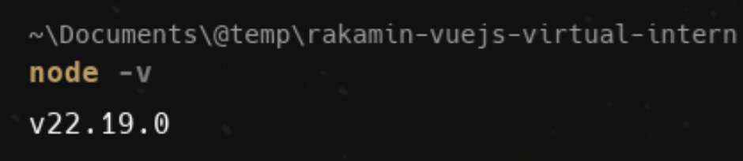
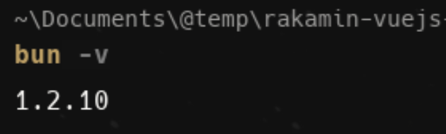

# Practice 1.1.a : Installation

## 1. Install Node JS
- Kunjungi https://nodejs.org/dist/v22.20.0/node-v22.20.0-x64.msi dan download.
- Jika sudah memiliki node js versi lama, tidak perlu khawatir, kita hanya perlu download dan install seperti biasa, maka ia akan otomatis ter-replace dengan versi baru.
- Selanjutnya, buka terminal dan jalankan perintah
    ```bash
    node -v
    ```
  

## 2. Install Bun
- Bukan terminal dan jalankan perintah berikut.
  ```bash
  npm install -g bun
  ```
- Jika berhasil, cek versi dengan perintah berikut
  ```bash
  bun -v
  ```
  