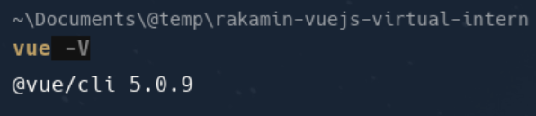

# Practice 1.2.a : Vue Installation

## Install Vue CLI
- Buka terminal dan ketikan perintah berikut.
    ```bash
    npm install -g @vue/cli
    ```
- Selanjutnya, buka terminal dan jalankan perintah
    ```bash
    vue -V
    ```
  